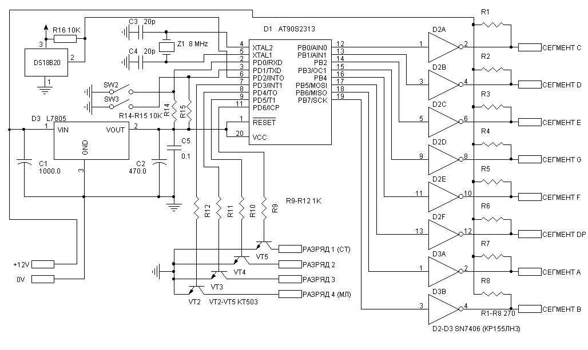

# Часы на микроконтроллере
## Краткое описание
Схема представляет собой не сложный вариант цифровых электронных
часов на основе микроконтроллера ATTINY2313.
Так же к ней можно подкючить один или несколько датчиков температуры
и сделать "метеостанцию".

Для отображения времени используются большие светодиодные
семисегментные индикаторы, я использовал SC18-11GWA с высотой
цифр 45 мм. Частота обновления информации на индикаторах - 200 Гц.
Режимы будильника, таймера и т.п. не предусмотренны. Есть функция
цифровой поправки хода, для улучшения точности.
Установка времени выполняется с помощью двух кнопок - первая
выбирает изменяемый параметр, вторая изменяет его значение.
Реализованы стандартные функции управления от кнопок, например
ускорение изменения параметра при продолжительном нажатии.

## Настройка и использование
### Установка времени и поправки
Для цифровой коррекции хода изменяется продолжительность самой
первой минуты каждых суток. Ее продолжительность равна 110 минус
значение поправки.

Например, если часы за сутки отстали на 5 секунд, то достаточно 
увеличить значение поправки на 5 чтобы часы шли точно.
При пропадании питания эта поправка сохраняется в
энергонизависимой памяти.

Эта фукнция позволяет сделать точность хода не хуже 1 секунды за сутки,
или около 6 минут за год.

1. Нажать кнопку SW2 для входа в режим настройки (при включении питания часы автоматически переходят в режим настройки, этот пункт нужет только если часы уже работают и требуется откорректировать их показания).
2. Кнопкой SW3 установить требуемые показания разряда часов.
3. Нажать кнопку SW2.
4. Кнопкой SW3 установить требуемые показания разряда минут.
5. Нажать кнопку SW2.
6. Кнопкой SW3 установить предварительно расчитаное значения цифровой поправки хода.
7. Нажать кнопку SW2 для возврата в режим отображения времни. В момент возврата внутренний счетчик секуд будет обнулен.

### Регулировка яркости
Кнопка SW3 также используется для выбора дневного или ночного
режима яркости, при нажатии на нее в обычном режиме работы
яркость индикаторов уменшается. Востановление яркости произойдет
автоматически примерно через 8 часов, или при повторном нажатии.

### Использование термометра
Если датчик температуры подключен к микроконтроллеру через кнопку,
при ее замыкании, микроконтроллер определяет наличие датчика и
выводит на индикатор измеренное значение температуры. При
размыкании кнопки происходит возврат в режим отображения времени,
если же датчик подключен напрямую или кнопка остается замкнутой в течении длительного времени,
то температура отображается в течении 30 секунд, после чего каждые
5 секунд будет происходить переключение режима отображения
часы-термометр.

## Схема

Кнопка SW1 предназначена для подключения датчика температуры. Можно
подключить несколько датчиков, каждый через свою кнопку, например
для измерения температуры в доме и на улице, или подключить один
датчик напрямую, без кнопки, все эти варианты поддерживаются
программой. Кнопками SW2 и SW3 выполняется настройка часов как
описано выше. Резисторы R1-R8 должны быть расчитаны на мощность 0,5
Вт. Конденсатор С5 надо разместить на минимальном растоянии от
выводов питания микроконтроллера, для дополнительной защиты от
помех в схему можно также добавть еще два таких же конденсатора
подключеных паралельно выводам питания микросхем D2, D3 (выводы 7 и
14). Точность можно дополнительно настроить изменением емкости
конденсаторов С3 и С4.

В качестве датчика температуры
исползьзуется микросхема DS18B20 или ее полный аналог. Использовать
неполный аналог, например DS1820 нельзя, т.к. из-за различий в
протоколе температура будет отображаться неправильно.

Светодиодные индикаторы должны быть с общим катодом, в
зависимости от их мощности подбираются номиналы резисторов R1-R8.

Для работы часов необходим блок питания обеспечивающий ток не менее
300 мА при напряжении 12-15 вольт.

Настройка fuses для записи программы в микроконтроллер показана
на [этом рисунке](ponyprogfuses.png).

## Программа
В папке src две верси прошивки, если датчик температуры не нужен, то лучше использовать версию 2 чтобы микроконтроллер не пытался его опросить.

### Изменения в [версии 2](src\Version20\CLOCK.HEX)
 - Добавлена программная регулировка яркости.
 - Добавлена защита от перезапусков при импульсных помехах по питанию
 - Поправка хода храниться в EEPROM.

### Изменения в [версии 3](src\Version31\CLOCK.HEX)
 - Добавлена поддержка датчика температуры DS18B20.
 - В режиме отображения времени добавлена мигающая точка между часами и минутами.
 - Отключен автоматический выход из режима установки времени по таймауту.
 - Изменена структура программы.

